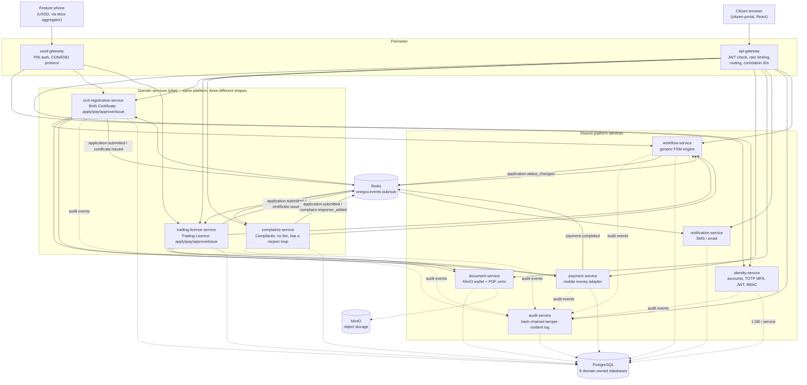

# Malawi OneGov — Pilot Architecture

This scaffold implements deep, end-to-end vertical slices of the national
Malawi OneGov platform described in the project brief: citizens applying for
a **Birth Certificate** or a **Trading Licence** (apply → pay → review →
digital issuance), and filing a **complaint** (a deliberately different
shape: no fee, no approve/reject branch, a real reopen loop). Three domain
services on one shared platform, not three separate platforms -- it is built
so every one of the platform's architectural principles is demonstrated in
real, runnable code rather than described in prose only.

## Component map

## How this maps to the full platform brief

| Brief component | This scaffold |
| --- | --- |
| Citizen identity and authentication gateway | `identity-service`: registration, bcrypt + TOTP MFA, JWT access/refresh, RBAC roles |
| Citizen web portal | `apps/citizen-portal`: mobile-first React SPA, English/Chichewa toggle |
| Government API gateway | `services/api-gateway`: single entry point, rate limiting, routing, correlation IDs, aggregate health check |
| Application/workflow management engine | `services/workflow-service`: generic finite-state-machine engine; each pilot service is one template (`src/templates.ts`) -- adding a new government service means registering another template, not rewriting the engine. The complaint template proves this isn't just copy-paste: it has no fee step, no approve/reject branch, and a real reopen loop the other two never needed |
| Payment gateway | `services/payment-service`: provider-adapter pattern (`PaymentProviderAdapter`) with a mock Airtel Money / TNM Mpamba stand-in; swap in a real adapter without touching calling code |
| Digital document and certificate wallet | `services/document-service`: MinIO-backed storage, presigned short-lived download URLs, server-side PDF certificate generation |
| SMS/email/push notification gateway | `services/notification-service`: event-driven consumer, SMS adapter (mocked, logging what a gateway like Africa's Talking would send), email via MailHog in dev |
| Audit and security monitoring | `services/audit-service`: append-only, hash-chained log (each record commits to the previous record's hash); `/events/verify` walks the chain to detect tampering |
| Role-based access control | Roles `CITIZEN`, `REGISTRAR_OFFICER`, `REGISTRAR_SUPERVISOR`, `SYSTEM_ADMIN` enforced per-route in every service, not just at the gateway |
| Government data-exchange layer | The `onegov.events` Redis bus (event choreography) plus direct internal REST calls secured by a shared service secret (request/response orchestration) -- both integration patterns are used deliberately in different places |
| Domain data ownership | Nine separate PostgreSQL databases (`infra/postgres-init`), one per service -- no shared mega-database |

## Two integration patterns, used deliberately

- **Request/response (orchestration):** `civil-registration-service` calls
  `workflow-service`, `document-service`, and `payment-service` directly over
  HTTP when it needs an immediate answer (e.g. "create a workflow instance
  for this new application").
- **Event choreography:** `payment-service` publishes `payment.completed`
  without knowing who's listening; `workflow-service` subscribes and
  auto-advances the application state; `civil-registration-service`
  subscribes to `application.status_changed` and, on `APPROVED`, generates
  the certificate and triggers `ISSUE` -- all without payment-service ever
  knowing civil registration exists. `complaints-service` subscribes to the
  same `application.status_changed` event to keep its own read-model
  `status` column in sync, but -- because it has no fee and generates
  nothing on resolution -- that's *all* its consumer does. No service had to
  change to accommodate a domain service that needs less choreography than
  the others, which is the actual proof the pattern generalizes: it isn't
  that every service needs the same event handling, it's that each
  subscribes to only what it needs.

This mirrors the real-world requirement to integrate agencies that don't all
expose the same kind of API: modern services can be choreographed via events;
legacy systems that can only be polled or that push flat files can be
integrated by writing an adapter that publishes the same event shapes onto
the bus, without changing any other service.

## Security controls implemented in code (not just described)

- Password + TOTP MFA required for every login (`identity-service`)
- JWT access tokens (short-lived) + rotated opaque refresh tokens
- RBAC enforced independently in every service (defense in depth, not just at the gateway)
- Tamper-evident audit log with an integrity-verification endpoint
- Per-service shared-secret authentication for internal service-to-service calls, distinct from citizen JWTs
- Rate limiting at the gateway and again on identity-service's auth routes
- Presigned, time-limited URLs for all document access (nothing in the wallet is public)
- helmet + CORS on every HTTP service

## What production would change

This is a pilot scaffold, not a production deployment. Before any real
rollout:

- Replace the hand-rolled `identity-service` auth with a standards-based IdP
  (Keycloak/OIDC), federated with the National Registration Bureau for
  identity proofing.
- Replace the lightweight Express gateway with Kong/Traefik/APISIX for
  production-grade WAF, mTLS, and plugin ecosystem.
- Replace Redis pub/sub (fire-and-forget) with Kafka or RabbitMQ for durable,
  replayable event delivery.
- Move workflow templates into a managed BPMN engine (e.g. Camunda) once the
  number of government services and approval chains grows beyond what a
  code-defined FSM can comfortably express.
- Run Prisma migrations (`prisma migrate deploy`) instead of `db push`, and
  put every service behind CI with SAST/DAST/dependency scanning.
- Terminate TLS everywhere, move secrets into a vault (HashiCorp Vault /
  cloud KMS) instead of environment variables.
